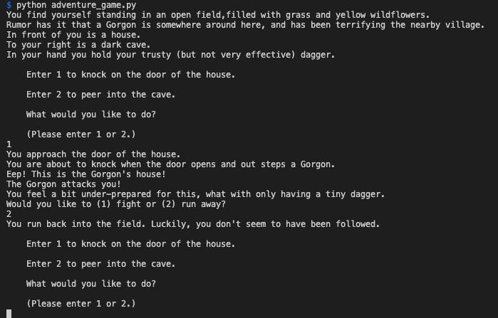

# adventure_game
Python terminal Adventure Game.

## First Look

## Do you want to play?

 + 1- Download this project
 + 2- in your terminal run `python adventure_game.py`

## Sources
  + [Python](https://lightsail.aws.amazon.com/ls/webapp/home/instances)
  + [Python Random](https://serverpilot.io/docs/how-to-create-a-server-on-amazon-lightsail)
  + [python time](https://stackoverflow.com/questions/14985798/python-random-function#:~:text=The%20'random'%20module%20is%20a,'random'%20package%20as%20well.)

